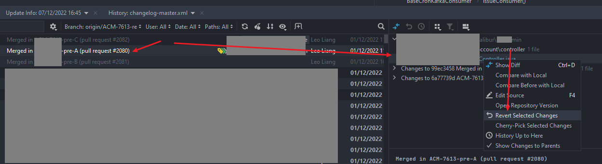

## Pull Request Revert

```
merge PR-A, PR-B, PR-C into pre-release branch
Expect: have a branch which include PR-B only

Solution One:
    check out a new branch branch-PR-B at the timing of merging PR-B
    revert at PR-A and get a branch named as Branch-revert-PR-A
    merge Branch-revert-PR-A into branch-PR-B
    However, branch-PR-B will include code of PR-B, PR-C other than PR-B only
```

```
Solution Two:
    check out a new branch branch-PR-B at the timing of merging PR-B
    revert selected changes of PR-A at the branch branch-PR-B
    commit the revert changes
    branch-PR-B will include code of branch of PR-B only
```
